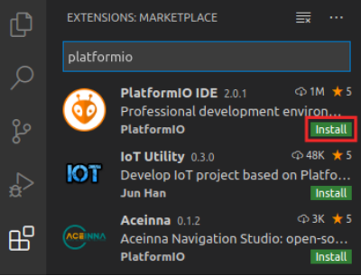

# 实验环境安装指南

## 1 Vivado 安装
Vivado 是一款用于查看、修改和合成 Verilog 代码的 Xilinx 工具。后续实验中将大量使用这款工具。
这里安装的版本是 Vivado 2019.2 WebPACK，具体安装步骤如下：

步骤1：导航到 https://reference.digilentinc.com/vivado/installing-vivado/start

步骤2： 系统将引导您进入Xilinx下载页面 https://www.xilinx.com/support/download.html

步骤3： 建议您安装“自提取Web安装程序”。在编写本文档时，下载页面链接如下：
[Xilinx统一安装程序2019.2：Linux自提取Web安装程序](https://www.xilinx.com/member/forms/download/xef.html?filename=Xilinx_Unified_2019.2_1106_2127_Lin64.bin)。
如果是 Windows 系统，使用如下下载链接：[Xilinx统一安装程序2019.2：Windows自提取Web安装程序](https://www.xilinx.com/member/forms/download/xef.html?filename=Xilinx_Unified_2019.2_1106_2127_Win64.exe)。

步骤4：在下载安装程序之前，系统会要求您登录Xilinx帐户。如果您还没有帐户，则需要创建一个。

步骤5：执行二进制文件。打开终端并将其设置为根（输入“sudo su”）。然后将二进制文件（Xilinx_Unified_2019.2_1106_2127_Lin64.bin）拖动到终端。
如果系统提示您将文件设置为可执行并运行它，请选择“OK”。 
WINDOWS：在Windows中，您只需双击在步骤3和4中下载的.exe文件即可执行。

步骤6：Vivado安装程序将指导您完成安装过程。重要注意事项：

- 选择Vivado（不是Vitis）作为要安装的产品。
- 选择Vivado HL Webpack(不是Vivado HL System Edition）；Webpack是免费的。
- 其他情况下，应选择默认设置。

提示：如果您更改Vivado的安装目录，则需要在以下步骤中适当修改路径。
WINDOWS：Windows不需要步骤7和8。您可以忽略这两个步骤，直接进入步骤9。

步骤7：安装Vivado后，您需要设置环境。打开终端并输入：source /tools/Xilinx/Vivado2019.2/settings64.sh

将该行（source /tools/Xilinx/Vivado2019.2/settings64.sh）添加到~/.bashrc文件中，以使其在您每次启动终端时都会运行。

步骤8：在终端中输入以下内容以测试Vivado：vivado

步骤9：安装线缆驱动程序。在终端窗口中输入以下内容：
cd /tools/Xilinx/Vivado/2019.2/data/xicom/cable_drivers/lin64/install_script/install_drivers/
sudo ./install_drivers

WINDOWS：在Windows中安装Vivado时会自动安装 Nexys4 DDR 开发板驱动程序，此驱动程序与PlatformIO不兼容。
因此，如果您使用的是Windows，则必须按照安装指南的附录A中的说明更新驱动程序。

步骤10：安装Digilent Board Files。

从Github资源库中下载vivado-boards的[归档文件](https://github.com/Digilent/vivado-boards/archive/master.zip?_ga=2.158467251.828100773.1587959567-2022567073.1577108610)并解压。

打开从归档文件中解压的文件夹并导航到其new/board_files目录。选中此目录下的所有文件夹并复制它们。

打开已安装的Vivado所在的文件夹（默认为/tools/Xilinx/Vivado）。在此文件夹下，导航到其<version>/data/boards/board_files目录，然后将电路板文件粘贴到此目录下。

也可以使用终端，方法是进入new/board_files目录并输入：
sudo cp -r * /tools/Xilinx/Vivado/2019.2/data/boards/board_files

WINDOWS：按照步骤10中的说明复制/粘贴下载的文件夹。在Windows中，您可以在以下位置找到Vivado的board_files文件夹：C:\Xilinx\Vivado\2019.2\data\boards\board_files

## 2 安装VSCode
步骤1：从以下链接下载.deb文件 https://code.visualstudio.com/Download

步骤2：打开终端，通过在终端中输入以下内容来安装和执行VSCode：
cd ~/Downloads
sudo dpkg -i code*.deb
code

Windows：VSCode软件包也适用于Windows（.exe文件），网址如下：	
https://code.visualstudio.com/Download。请遵循在这些操作系统中安装和执行应用程序的通用步骤。

## 3 基于VSCode安装PlatformIO
PlatformIO是一款面向嵌入式系统的集成开发环境（Integrated Development Environment，IDE），
基于Microsoft的Visual Studio（VS）Code构建。它允许您使用C语言或汇编语言对RISC-V处理器（位于FPGA上）进行编程。
PlatformIO支持跨平台使用，并且内置调试器。

PlatformIO 的具体安装步骤如下：
步骤1：在终端中输入以下内容，以安装python3实用程序：
sudo apt install -y python3-distutils python3-venv 

Windows：Windows中不需要这一步骤。

步骤2：如果VSCode尚未打开，请通过以下方式将其启动：选择“Start”（开始）按钮并在搜索菜单中输入“VSCode”，然后选择VSCode；或者在终端中输入code。

步骤3：在VSCode中，单击位于VSCode左侧边栏上的“Extensions”（扩展）图标 

步骤4：在搜索框中输入PlatformIO，然后单击PlatformIO IDE旁边的安装按钮进行安装，如下图所示。

## 4 仿真
在将 led_lights 电路正式综合和下载到开发板运行之前，需要先对设计进行仿真，以检查电路设计是否正确。
点击Project Manager 下面 Add Source，在弹出的菜单中选择添加 Simulation Sources，如图所示。

创建一个名为 led_lights_tb 的仿真设计文件。然后，打开该文件，完成仿真程序的设计。
led_lights_tb 程序设计好后，项目文件层次如图所示。

为了仿真能快一些，我们需要修改一下 clock_div.v 的代码，将下面一句
if(div_counter>=62500000) begin
改为
if(div_counter>=50) begin
这样，我们用 1us 来仿真 1 秒。 在 Project Manager 中点击 Run Simulation，
在弹出的菜单中选择 Runbehavior Simulation。
将工具条中的仿真时间调整为 10us，重新仿真。仿真完后，得到如图所示的波形图。
从图中我们可以明显地看到， 0.5us 后 resetn 信号无效，计数器和 3-8 译码器开始工
作，每隔 1us，3-8 译码器在计数器的推动下，换一个输出， Y7-Y0 依次输出，周而复始。
通过仿真，证明了我们设计的 led_lights 电路是正确的。

## 5 添加约束文件
首先，我们要把 clock_div.v 的代码修改回来，将下面一句
if(div_counter>=50) begin
改为
if(div_counter>=62500000) begin

点击 Project Manager 下面 Add Source，在弹出的菜单中选择添加 Constraints 文件，如图所示。

创建一个名为 led_lights 的约束文件。然后，打开该文件，完成引脚的绑定。
约束文件设计完成后，项目文件层次如图所示。

## 6 生成比特流文件并下载
在 Project Manager 中点击 Generate Bitstream。
比特流生成后会出现图所示的对话框。点击 Cancel 取消即可。
如果生成比特流发生错误，需要根据 Vivado 给出的错误信息，相应的修改程序，重新生成。

用 USB 下载线将 Pynq-Z1 开发板的 USB JTAG 与 PC 机的 USB 相连。
如图所示，（4）即是Pynq-Z1 开发板的 USB JTAG。打开电源开关，图中所示（6）。

选中 Open Hardware Manager，连接 Pynq-Z1 板，下载比特流，然后观察跑马灯运行是否正确。