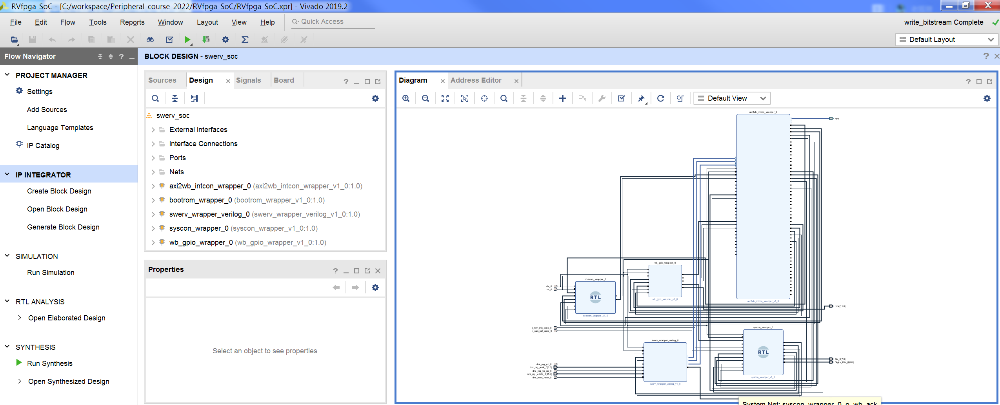
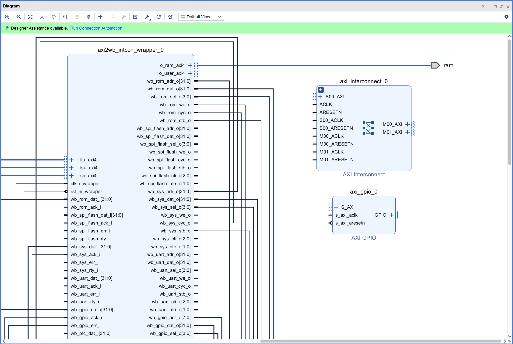
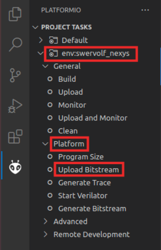
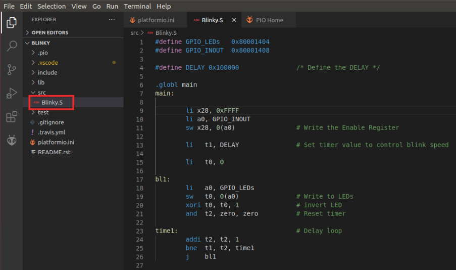
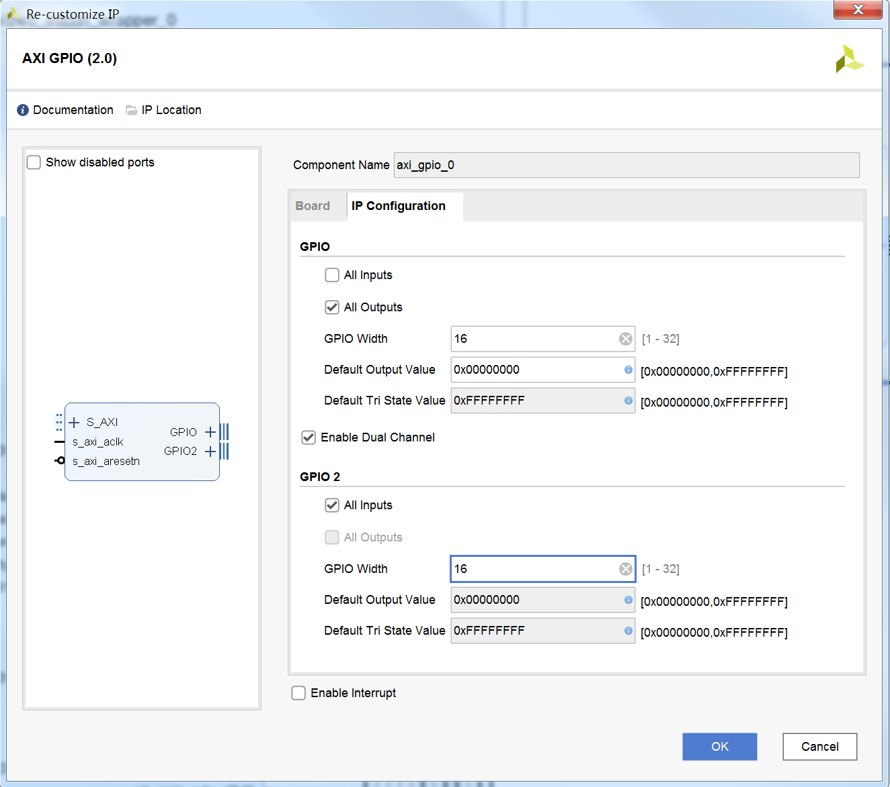
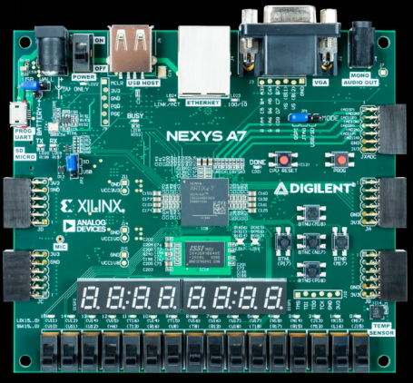

# GPIO 实验

## 1. 概述
在本实验中，我们在Vivado中通过IP集成的方法，搭建了一个简单的RVfpga处理器系统；该系统主要包括：RVfpga处理器IP、内存、GPIO等外设模块；
利用PlatformIO我们可以编写C语言程序对RVfpga处理器系统的外设进行操作演示。

## 2. 在RVfpga中添加基于AXI4接口的GPIO模块
启动Vivado，打开实验 1 的工程，如下图所示。

点击“Open Block Design”打开块设计，如下图所示。

添加AXI Interconnect和AXI GPIO二个IP模块，如下图所示。

双击axi_interconnect_0模块，将“Number of Master Interfaces”的数量从2减少为1，如下图所示。

将新添加的IP模块连接到原来的块设计中，如下图所示。

双击axi_gpio_0模块，勾选“All Outputs”，然后将“GPIO Width”的数量从32修改为16；同时勾选“Enable Dual Channel”，此时GPIO 2的选项由灰变亮，之后勾选GPIO 2中的“All Inputs”，然后将“GPIO Width”的数据从32修改为16；完成设置后如下图所示。

将axi_gpio_0模块的GPIO和GPIO2端口展开，将相应的引脚设为外部引脚，然后将输出引脚更名为“o_led”，输入引脚更名为“i_sw"，如下图所示。

打开“Address Editor”，为axi_gpio_0模块分配起始地址“0x80100000”，如下图所示。

点击Validate Design，对设计的正确性进行校验。校验过程中如果出现警告，点击OK忽略。

点击Generate Block Design，弹出对话框后选择Generate更新swerv_soc_wrapper文件。

根据更新后的swerv_soc_wrapper对rvfpga.sv文件进行修改，如下图所示，增加“o_led”和“i_sw”的连接，同时注释270、271和273这三行代码。

最后，点击Generate Bitstream按键，生成bitstream文件。

## 3. 应用程序编译、调试和执行

1.进入MIPSfpga_axi4_C目录，编辑main.c文件可以进行系统外设的操作控制。编辑完成后在该目录下用鼠标右键选择打开cmd命令窗口。在该命令窗口中输入make进行编译生成elf可执行文件。使用make clean命令可以将编译的结果清除。

2.连接Nexys4 DDR开发板bit文件下载线缆，同时将MIPSfpga的调试器按照下图所示连接到Nexys4 DDR开发板。连接完成后首先将比特流文件Bitstream下载到Nexys4 DDR开发板，然后按CPU_RESET按钮启动系统固化的程序运行。

3.退出MIPSfpga_axi4_C目录，进入Codescape_Scripts目录，在该目录下用鼠标右键选择打开cmd命令窗口。在命令窗口中输入如下命令运行loadMIPSfpga.bat批处理文件：
loadMIPSfpga.bat C:\workspace\MIPSfpga_Peripheral_2017\MIPSfpga_axi4_C

4.观察程序的运行情况。
四、动手实践
1.打开MIPSfpga_axi4工程，点击Open Block Design菜单进入图形化的IP集成环境，双击axi_gpio_0模块添加16个输入引脚。

2.
3.点击Generate Block Design，弹出对话框后选择Generate更新MIPSfpga_system_wrapper文件。

4.添加约束文件，即将16个GPIO的输入引脚绑定到开发板的滑动开关。最后，点击Generate Bitstream按键，生成bitstream文件。Mipsfpga综合实现后观察时序能否满足CPU运行时钟的频率要求。

5.参照前面“应用程序编译、调试和执行”章节编写演示程序，要求通过开关的不同输入控制LED灯的显示。

