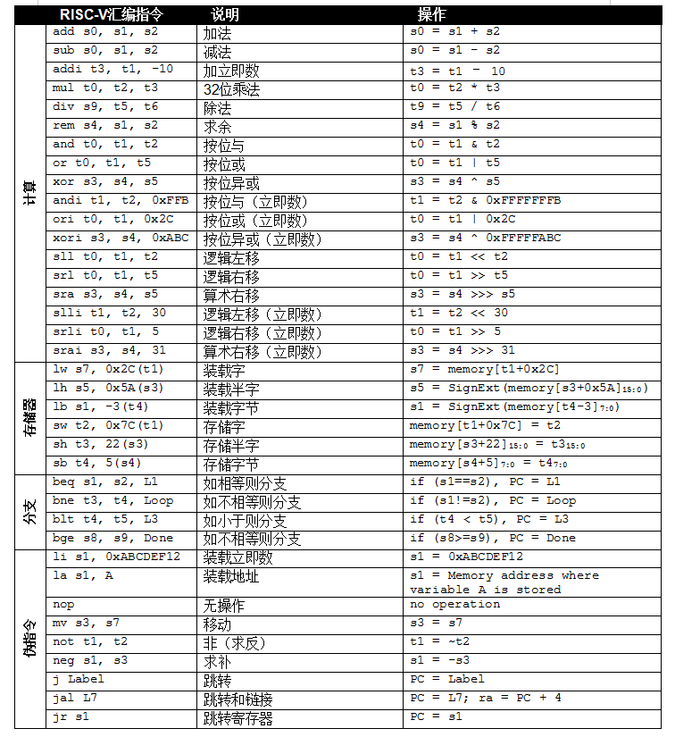
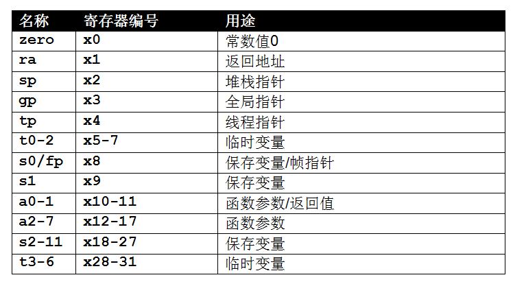
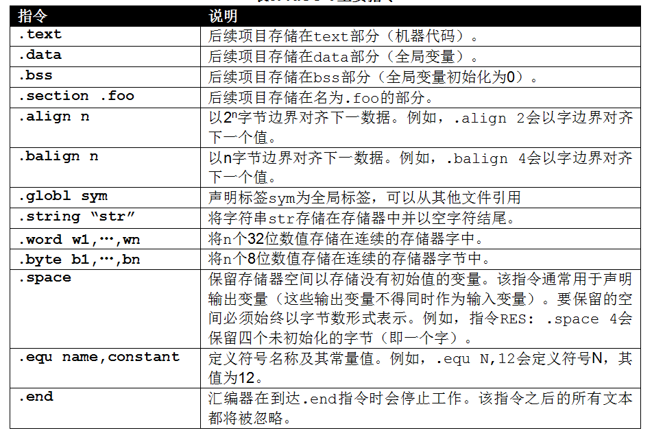
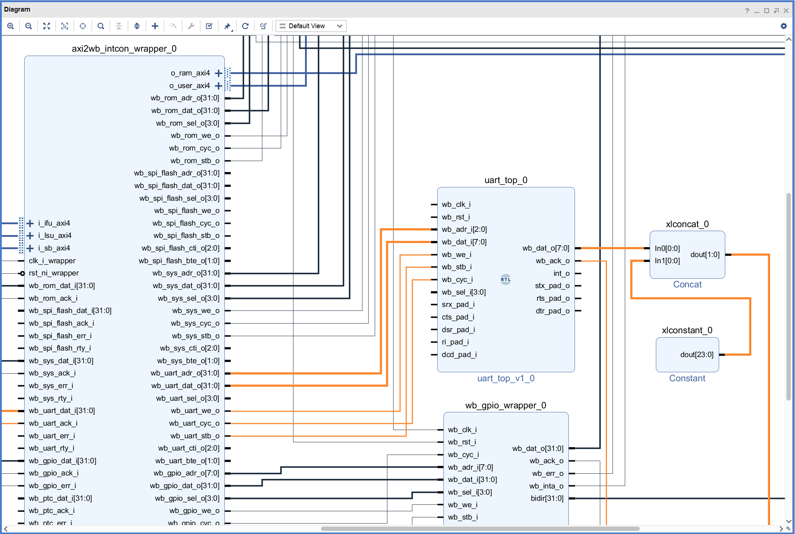
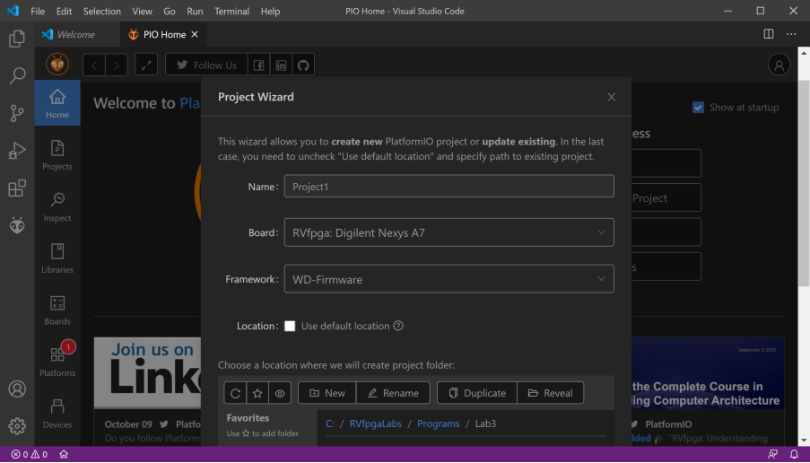
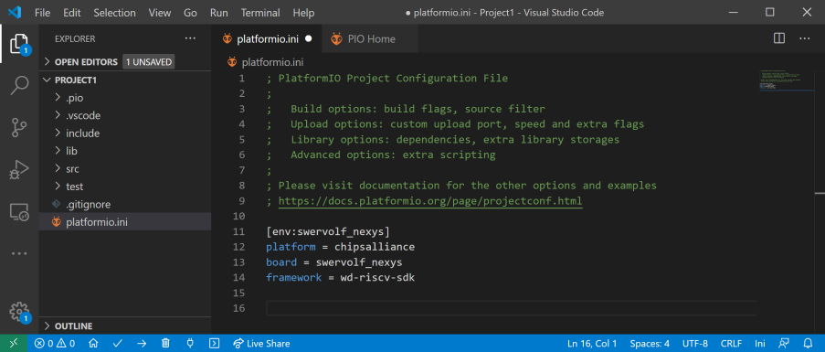
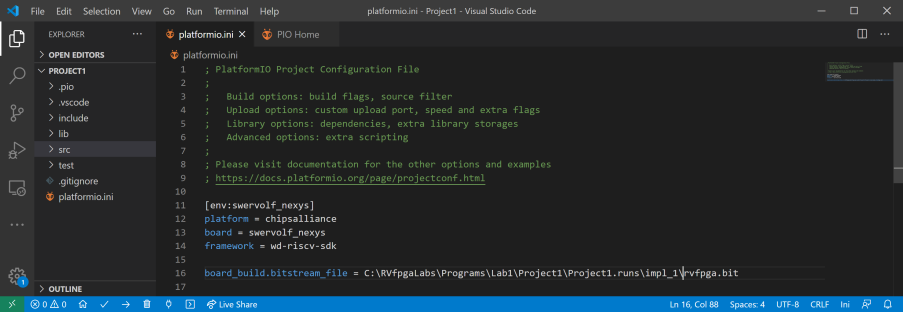
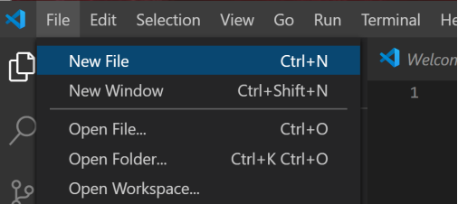
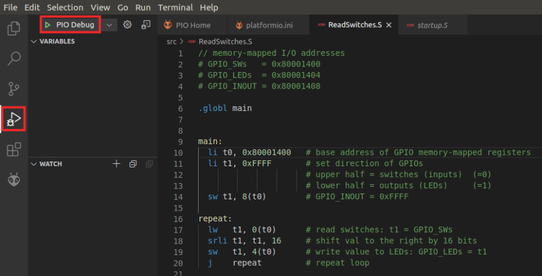
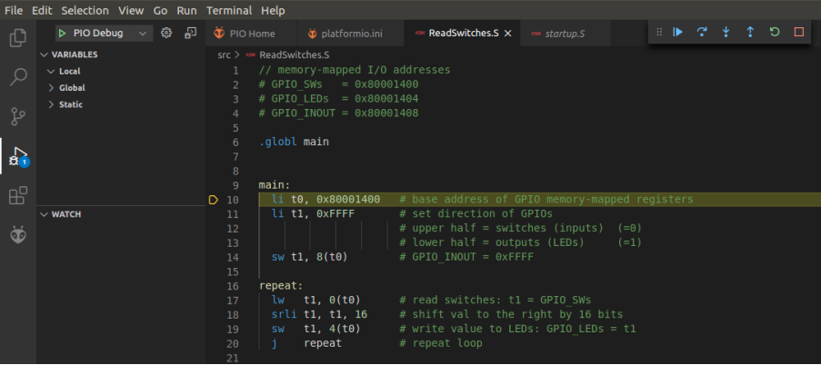

# 汇编语言实验

## 1. 概述
本实验将展示如何使用PlatformIO创建一个可在RVfpga上运行的RISC-V汇编语言程序。

RISC-V汇编语言包含用于实现高级代码的简单指令。例如add、sub和mul等常用的RISC-V指令（分别用于对两个操作数进行加法、减法和乘法运算）。

RISC-V指令的基本类型包括：计算（算术、逻辑和移位）指令、存储器操作和分支/跳转。

下表中列出了最常用的RISC-V指令。

指令使用的操作数位于寄存器或存储器中，或者被编码为常量（即立即数）。

RISC-V包含32个32位寄存器，下表列出了这32个RISC-V寄存器的名称。

这些寄存器可以使用寄存器名称（例如zero、s0、t5等）或寄存器编号（即x0、x8、x30）来指定。编程器通常使用寄存器名称，其中保留有一些关于寄存器典型用途的信息。例如，保存寄存器s0-s11通常用于程序变量，而临时寄存器t0-t6用于临时计算。zero寄存器（x0）中始终包含值0，因为程序中通常需要该值。其他寄存器也均有特定用途，如上表所示。

除了实际的RISC-V指令，RISC-V还包括伪指令，伪指令并非真正的RISC-V指令，但编程器经常使用。伪指令是使用一个或多个真正的RISC-V指令实现的。例如，移动伪指令（mv s1, s2）会复制s2的内容并将其放入s1。该指令是使用以下真正的RISC-V指令实现的：addi s1, s2, 0。

以句点开头的命令为汇编器指令。这些指令是汇编器需执行的命令，而不是汇编器要转换的代码。这些指令会告知汇编器放置代码和数据的位置，指定在程序中使用的文本和数据常量等。下表列出了RISC-V的主要汇编器指令（《RISC-V读取器：开源架构Atlas》，作者：Patterson & Waterman，© 2017）。

有关RISC-V汇编语言的更多详细信息，请参见[《RISC-V指令集手册》](https://github.com/riscv/riscv-isa-manual/releases/download/Ratified-IMAFDQC/riscv-spec-20191213.pdf)

## 2. RVfpga编写RISC-V汇编程序
在编写程序之前，请按照以下步骤设置PlatformIO项目，然后在RVfpga上创建并运行汇编程序：

- 创建RVfpga项目
- 编写RISC-V汇编语言程序
- 将RVfpga下载到Nexys4 DDR FPGA开发板
- 编译、下载和运行汇编程序

### 2.1 创建RVfpga项目
启动VSCode，如果VScode启动后PlatformIO没有自动打开，请单击左侧功能区菜单中的PlatformIO图标，然后单击“PIO Home”（PIO主页）→“Open”（打开）（如下图所示）。

在“PIO Home”（PIO主页）欢迎窗口中，单击“New Project”（新建项目），如上图所示。

这里假设将项目命名为“Project1”，在“Board”（电路板）部分选择“RVfpga: Digilent Nexys A7”（输入RVfpga，即可出现该选项）。保留框架的默认选项WD-framework（Western Digital框架，其中包含Freedom-E SDK gcc和gdb）。取消选中“Use default location”（使用默认位置），然后将程序放到以下路径：[RVfpgaPath]/RVfpga/Labs/Lab3（如下图所示）。

然后点击窗口底部的“Finish”（完成）。

在左侧“Explorer”（资源管理器）窗格的PROJECT1下（可能需要展开），双击platformio.ini打开该文件（如下图所示）。该文件为PlatformIO初始化文件。

将要加载到FPGA上的RVfpga比特流文件路径添加到platformio.ini文件，如下图所示，按Ctrl-s保存platformio.ini文件。

### 2.2 编写RISC-V汇编语言程序
单击“File”（文件）→“New File”（新建文件）（如下图所示）。

将打开一个空白窗口。在该窗口中输入RISC-V汇编程序。程序输入完成后，按Ctrl-s保存文件。

### 2.3 将RVfpga下载到Nexys4 DDR FPGA开发板
单击左侧功能区菜单中的PlatformIO图标 ，展开“Project Tasks”（项目任务）→ env:swervolf_nexys →“Platform”（平台），然后单击“Upload Bitstream”（上传比特流），将RVfpga下载到Nexys4 DDR开发板。

### 2.4 编译、下载和运行RISC-V汇编程序
单击左侧功能区菜单中的“Run”（运行）按钮，然后单击“Start Debugging”（开始调试）按钮，如下图所示。

程序将下载至Nexys4 DDR开发板的FPGA上所运行的RVfpga。此时即可开始运行和调试程序，如下图所示。

