# 基于 Nexys4 DDR 开发板的跑马灯实验

## 1 引言
本实验将使用 Vivado 工具，利用一个自制的 8 进制计数器 IP 核、一个时钟分频器和一
个简化的 38 译码器来实现一个每秒变换一次的跑马灯电路。实际上，做跑马灯完全不
用这么复杂，但我们希望通过这个实验，您将学会 Vavido 的设计流程，IP 核的封装与
使用。所有代码均用 Verilog HDL 语言编写。

## 2 自制一个 8 进制计数器的 IP 核
### 2.1 创建一个新项目
双击 Vivado 图标， 打开 Vivado 图形界面；然后，创建一个新项目，如图所示。

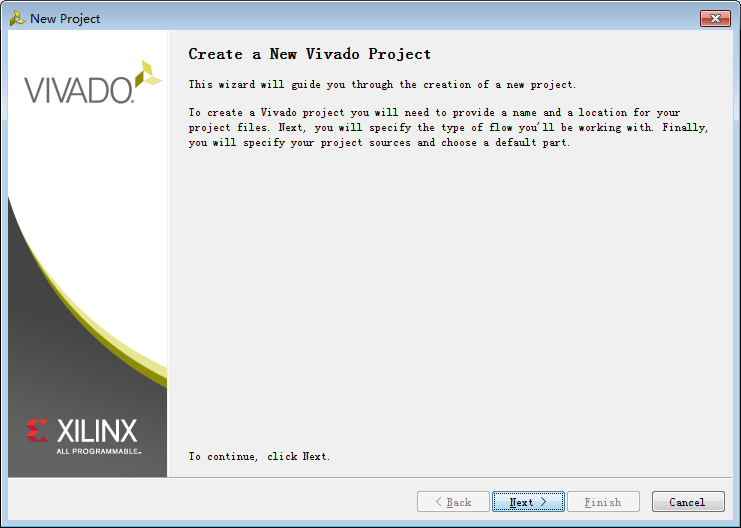

点击 Next，显示如图所示的界面；按图中所示命名项目名称和路径，这这里项目名
称为 ctc8，项目的位置是 D:/MIPSfpga_Fundamentals/Xilinx/VivadoProject，点击 Next。最后，
整个项目将在 D:/MIPSfpga_Fundamentals/Xilinx/VivadoProject/ctc8 中。

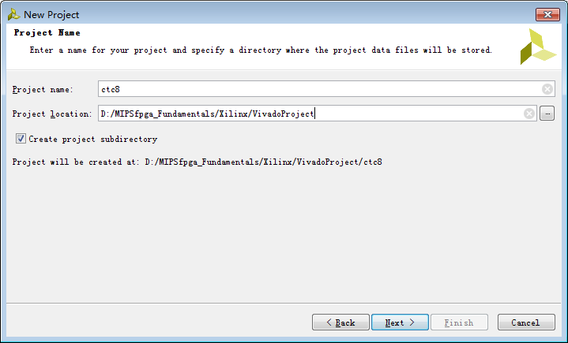

显示如图所示界面，点击 Next。因为不需要增加源文件，也不需要增加 IP 核和约束文件，所以图中勾选了“Do not specify at this time”。

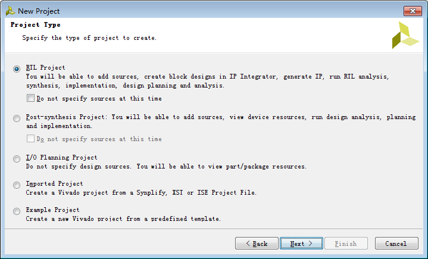

按图所示选择 Nexys4 DDR 开发板，点击 Next。

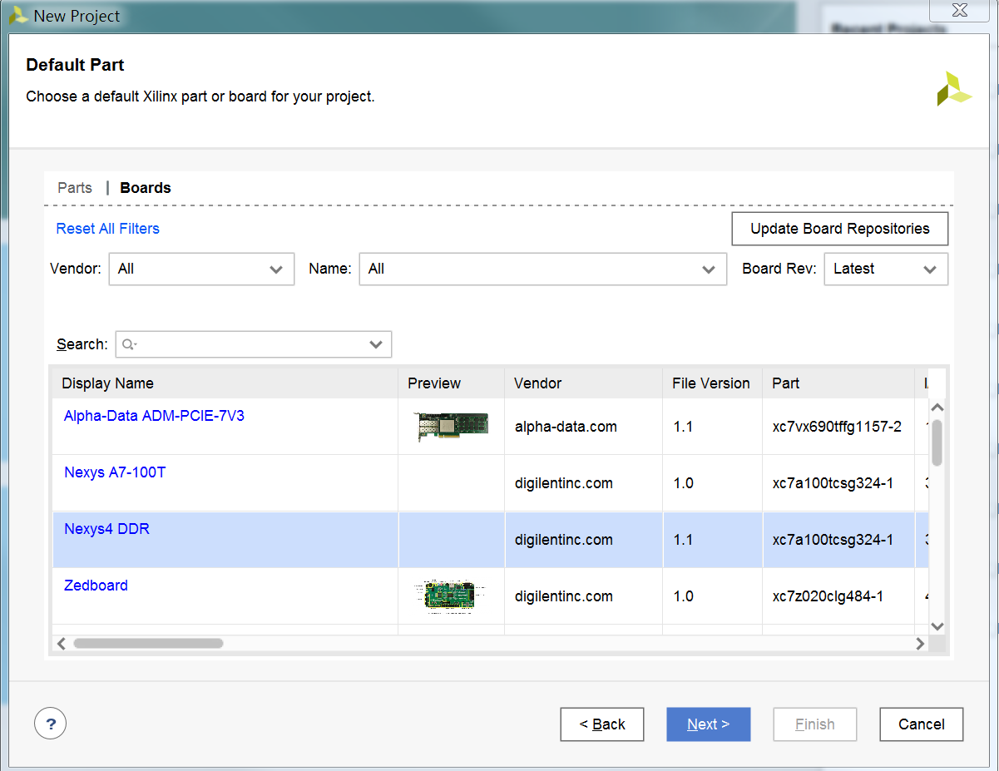

显示如图所示界面，点击 Finish 完成新建工程。

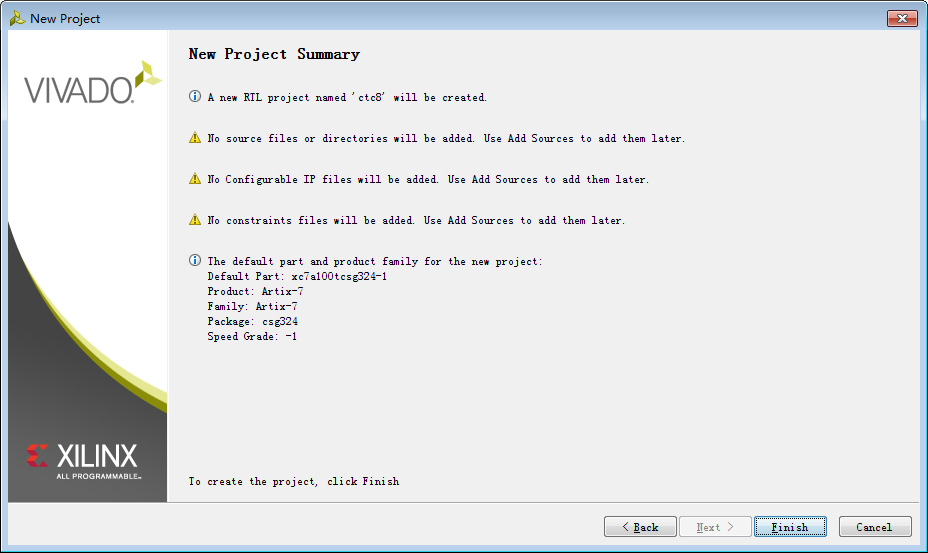

### 2.2 添加源代码
在图示的窗口中点击 Add Sources。

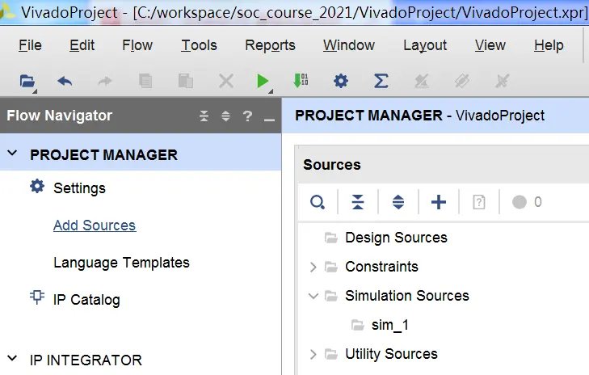

如图所示，选择“Add or create design sources”，后点击 Next。

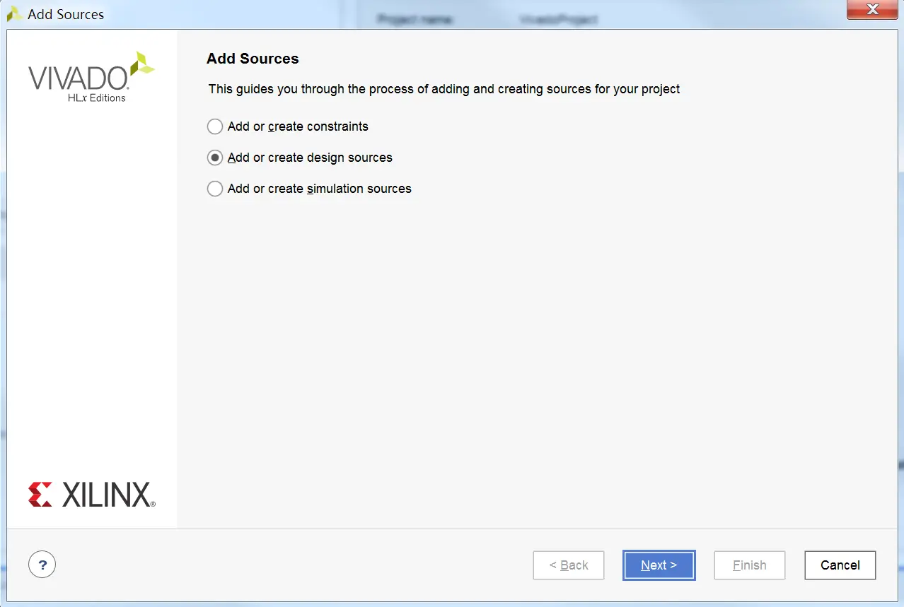

如图所示，选择“Create File ...”。

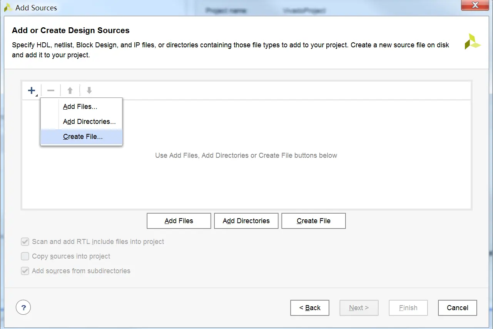

在弹出的对话框中输入设计文件名，这里文件名为“ctc8”，然后点击 OK。

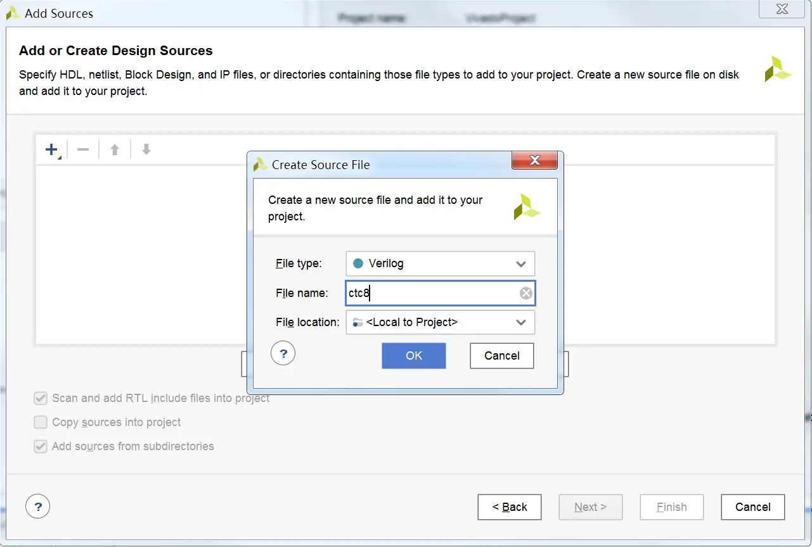

点击 Finish 完成设计文件的添加，如图所示。

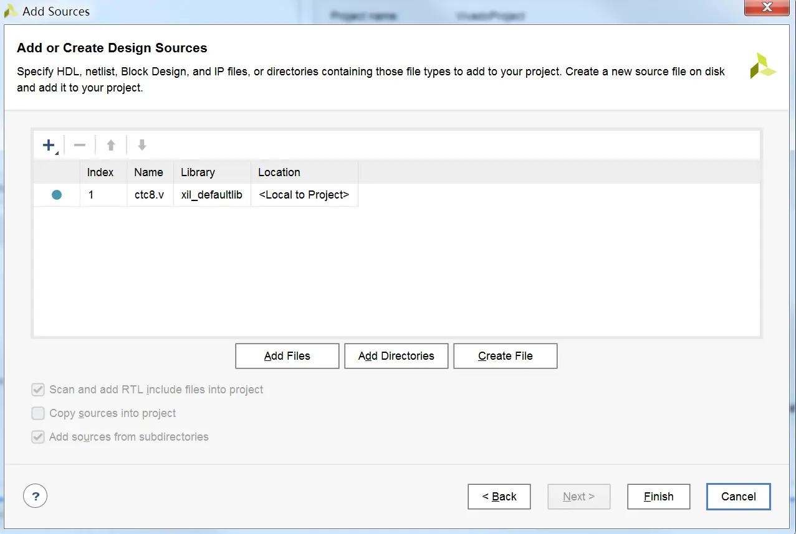

在弹出的对话框中点击 OK，如图所示。

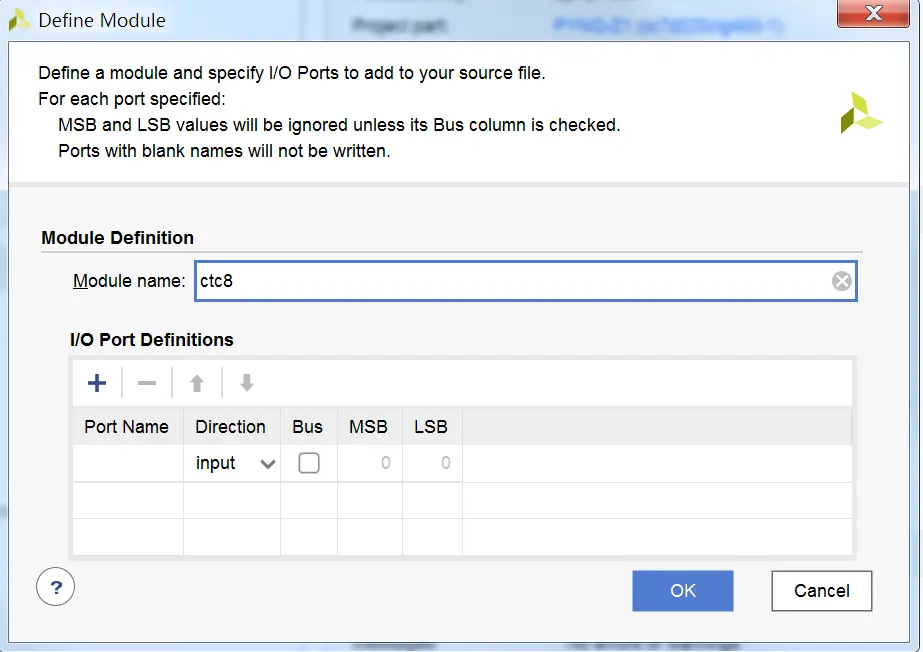

在接着弹出的对话框中点击 Yes，如图所示。

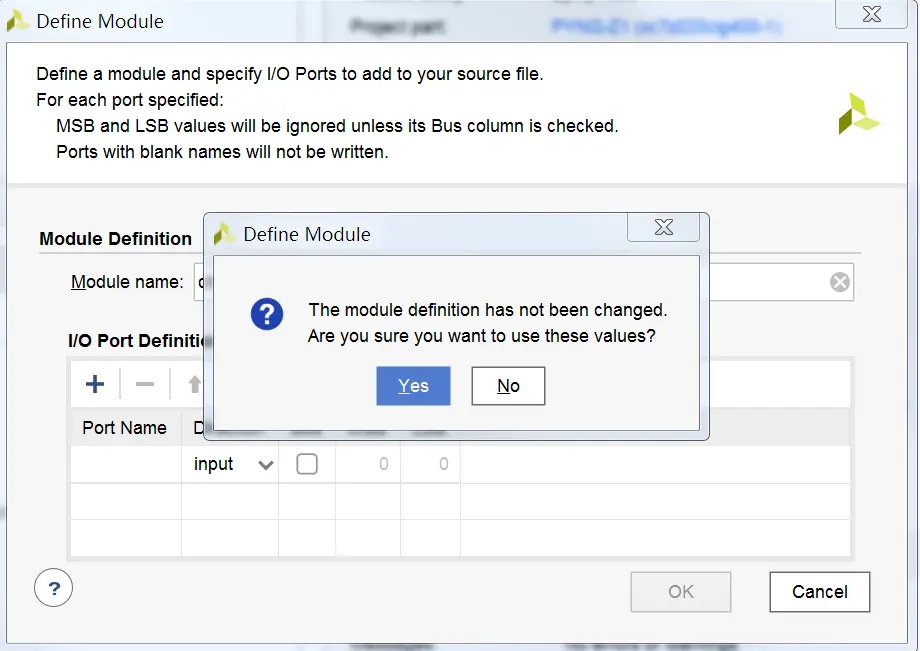

双击打开新建的 ctc8 文件，完成该电路的设计，如图所示。

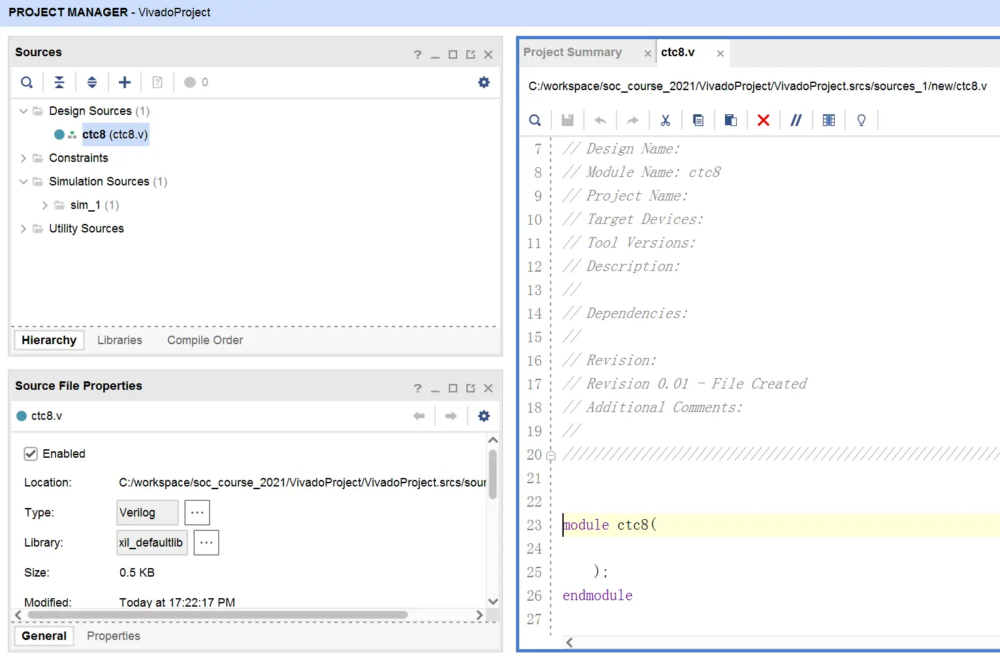

ctc8 这段程序描述了一个 8 进制计数器，每次时钟上升沿到来，计数器减 1，减到 0 后重
新开始计数。 Reset 为低电平的时候复位。

### 2.3 综合
ctc8 电路代码写好以后，需要进行综合。综合完成后，如果出现下图所示对话框，选择 Cancel。
如果综合失败，需要根据 Vivado 输出的错误信息，相应的修改电路，然后重新进行综合，直到设计正确为止。

### 2.4 IP 封装
点击 Project Settings。在 Project Settings 对话框中选择 IP，并进入 Packager 选项卡，
如图所示进行设置。设置好后，点击 Apply，然后点击 OK。记住这里设置的各个属性。

在 Vivado 的菜单栏中选择 Tools->Create and Package IP…。在弹出的窗口中点击
Next。在之后弹出的窗口中如图所示设置封装选项。 点击 Next。

在弹出的 IP Location（如图所示）中我们不做修改，点击 Next。在最后的对话框中点击 Finish。

按照下图所示，完成 IP 封装的设置。由于电路非常简单，因此这里基本上不需要进行任何设置，直接使用默认值就可以。

接下来我们到 Review and Packaging（如图所示），点击 Package IP，完成 IP的封装。

我们可以看到 IP 生成到一个名为 xilinx.com_user_ctc8_1.0.zip 文件中， 路径是
C:\workspace\soc_course_2021\VivadoProject\VivadoProject.srcs\sources_1\new。
这样， ctc8 的 IP 核就生成了。

## 3 创建跑马灯项目
### 3.1 创建一个新的项目
参考 2.1 的步骤，创建一个新的项目，新项目名称为 led_lights，如图所示。

### 3.2 使用 ctc8 IP 核
#### 3.2.1 导入 ctc8 IP 核到 IP catalog
到 C:\workspace\soc_course_2021\VivadoProject\VivadoProject.srcs\sources_1\new 路径下
将 xilinx.com_user_ctc8_1.0.zip 文件拷贝到下面的路径中。
C:\workspace\soc_course_2021\leg_lights。
然后将其解压到 xilinx.com_user_ctc8_1.0，如图所示。

点击 Project Settings，打开 Project Settings 对话框，并转到 IP 项上。如图所示添加 IP。

#### 3.2.2 将 ctc8 IP 核导入到项目中
在 3.2.1 中，我们已经将 ctc8 IP 核导入到了 IP Catalog 中，我们现在需要将它导入到
我们的项目中。在如图所示，选择 IP Catalog 菜单，打开 IP 库；然后双击 ctc8_v1_0，添加 ctc8 IP 核。

如图所示，弹出 ctc8_v1_0 定制窗口。

点击 OK，弹出如图所示的 Generate Output Products 窗口，点击 Generate。

在随后弹出的对话框中点击 OK。 此时我们在 Project Manager 的 Sources 中可以看
到刚加进去的 ctc8_0，如图所示。

### 3.3 添加分频器的源代码
Pynq-Z1 板上提供了一个 125MHz 的时钟，但我们的跑马灯是 1 秒一变换，因此需
要一个分频器， 将 125MHz 降到 1Hz。通过 Add Sources….，添加 clock_div 文件。
然后，打开该文件，实现了一个加 1 计数器，每当 125MHz 的时钟上升沿，计数器加 1，
每次计数器到 62500000 的时候输出电平翻转，这样输出的波形的周期刚好 1 秒，频率为 1Hz。

### 3.4 添加简易 38 译码器的源代码
同样步骤，添加一个 s_38 文件。然后，打开该文件，实现一个简单的 3-8 译码器。

### 3.5 创建顶层文件
同样步骤，添加一个命名为 led_lights 的文件。然后，打开该文件，完成电路的设计。
首先，对上述创建的三个模块进行了例化；然后，用 Verilog 语言将三个模块用线连
接了起来。时钟和 resetn 控制计数器工作， resetn 还同时作为 3-8 译码器的使能端。
计数器的三个输出分别接到 3-8 译码器的 CBA 输入上，随着计数值的变化， 3-8 译
码器输出发生变化。顶层文件还定义了对外的接口，两个输入 clock， resetn 分别接板
上时钟信号和复位信号， Y0-Y7 的 8 个输出分别连接板上的 LED 灯。
到此，如图所示，所有的模块都建好了。

## 4 仿真
在将 led_lights 电路正式综合和下载到开发板运行之前，需要先对设计进行仿真，以检查电路设计是否正确。
点击Project Manager 下面 Add Source，在弹出的菜单中选择添加 Simulation Sources，如图所示。

创建一个名为 led_lights_tb 的仿真设计文件。然后，打开该文件，完成仿真程序的设计。
led_lights_tb 程序设计好后，项目文件层次如图所示。

为了仿真能快一些，我们需要修改一下 clock_div.v 的代码，将下面一句
if(div_counter>=62500000) begin
改为
if(div_counter>=50) begin
这样，我们用 1us 来仿真 1 秒。 在 Project Manager 中点击 Run Simulation，
在弹出的菜单中选择 Runbehavior Simulation。
将工具条中的仿真时间调整为 10us，重新仿真。仿真完后，得到如图所示的波形图。
从图中我们可以明显地看到， 0.5us 后 resetn 信号无效，计数器和 3-8 译码器开始工
作，每隔 1us，3-8 译码器在计数器的推动下，换一个输出， Y7-Y0 依次输出，周而复始。
通过仿真，证明了我们设计的 led_lights 电路是正确的。

## 5 添加约束文件
首先，我们要把 clock_div.v 的代码修改回来，将下面一句
if(div_counter>=50) begin
改为
if(div_counter>=62500000) begin

点击 Project Manager 下面 Add Source，在弹出的菜单中选择添加 Constraints 文件，如图所示。

创建一个名为 led_lights 的约束文件。然后，打开该文件，完成引脚的绑定。
约束文件设计完成后，项目文件层次如图所示。

## 6 生成比特流文件并下载
在 Project Manager 中点击 Generate Bitstream。
比特流生成后会出现图所示的对话框。点击 Cancel 取消即可。
如果生成比特流发生错误，需要根据 Vivado 给出的错误信息，相应的修改程序，重新生成。

用 USB 下载线将 Pynq-Z1 开发板的 USB JTAG 与 PC 机的 USB 相连。
如图所示，（4）即是Pynq-Z1 开发板的 USB JTAG。打开电源开关，图中所示（6）。

选中 Open Hardware Manager，连接 Pynq-Z1 板，下载比特流，然后观察跑马灯运行是否正确。
