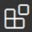
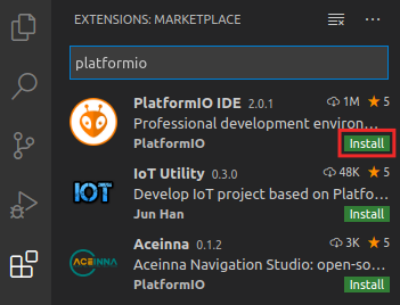
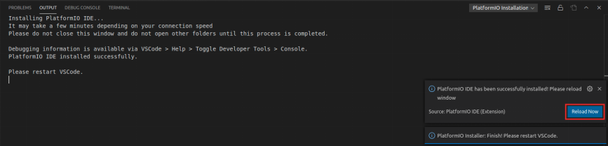
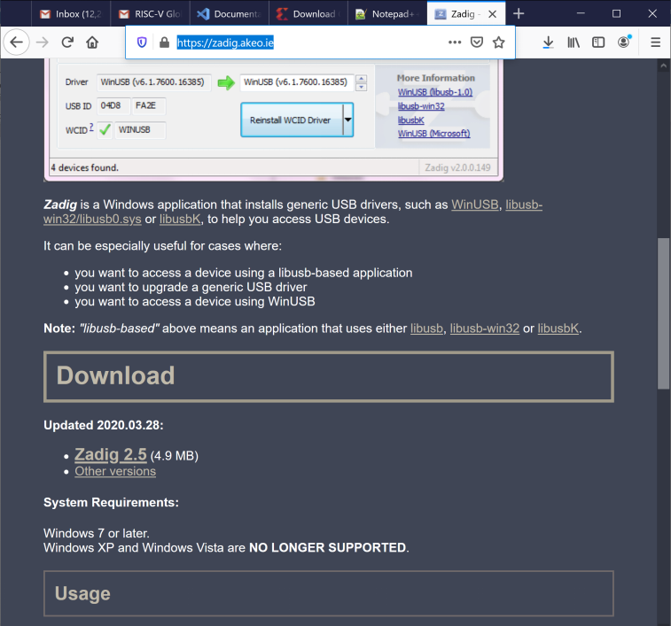
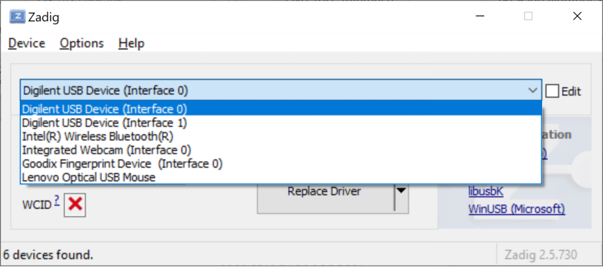
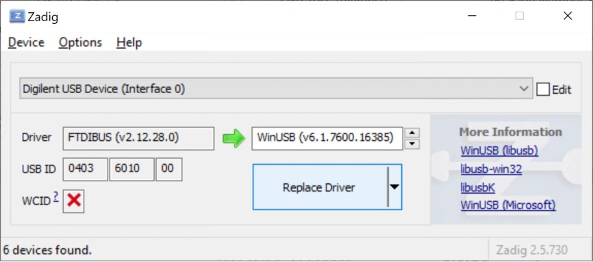
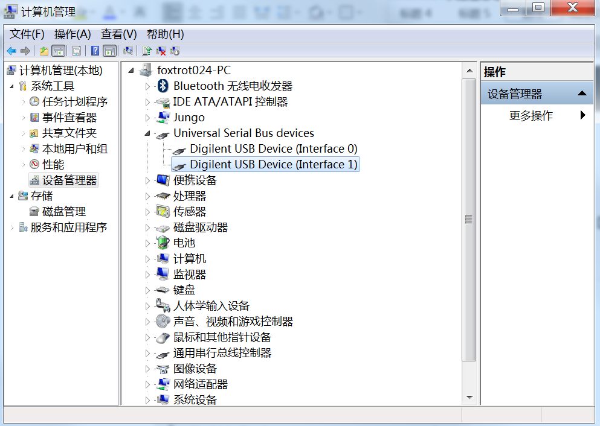
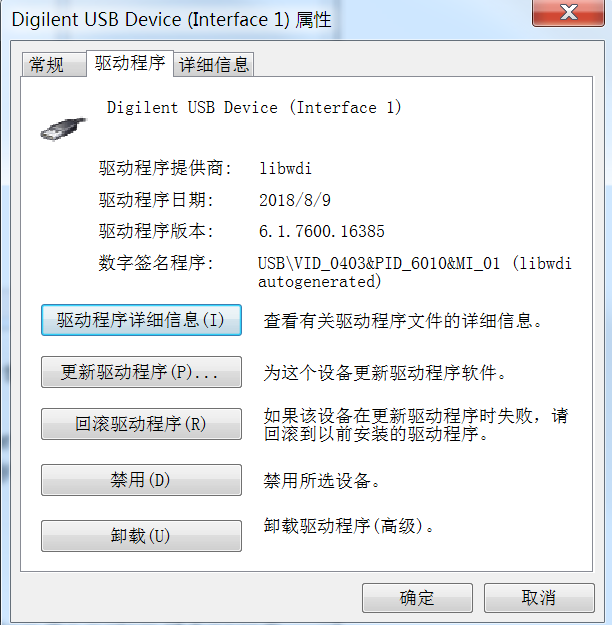

# 实验环境安装指南

## 1  Vivado 安装
Vivado 是一款用于查看、修改和合成 Verilog 代码的 Xilinx 工具。后续实验中将大量使用这款工具。
这里安装的版本是 Vivado 2019.2 WebPACK，具体安装步骤如下：

步骤1：导航到 https://reference.digilentinc.com/vivado/installing-vivado/start

步骤2： 系统将引导您进入Xilinx下载页面 https://www.xilinx.com/support/download.html

步骤3： 建议您安装“自提取Web安装程序”。在编写本文档时，下载页面链接如下：
[Xilinx统一安装程序2019.2：Linux自提取Web安装程序](https://www.xilinx.com/member/forms/download/xef.html?filename=Xilinx_Unified_2019.2_1106_2127_Lin64.bin)。
如果是 Windows 系统，使用如下下载链接：[Xilinx统一安装程序2019.2：Windows自提取Web安装程序](https://www.xilinx.com/member/forms/download/xef.html?filename=Xilinx_Unified_2019.2_1106_2127_Win64.exe)。

步骤4：在下载安装程序之前，系统会要求您登录Xilinx帐户。如果您还没有帐户，则需要创建一个。

步骤5：执行二进制文件。打开终端并将其设置为根（输入“sudo su”）。然后将二进制文件（Xilinx_Unified_2019.2_1106_2127_Lin64.bin）拖动到终端。
如果系统提示您将文件设置为可执行并运行它，请选择“OK”。 
WINDOWS：在Windows中，您只需双击在步骤3和4中下载的.exe文件即可执行。

步骤6：Vivado安装程序将指导您完成安装过程。重要注意事项：

- 选择Vivado（不是Vitis）作为要安装的产品。
- 选择Vivado HL Webpack(不是Vivado HL System Edition）；Webpack是免费的。
- 其他情况下，应选择默认设置。

提示：如果您更改Vivado的安装目录，则需要在以下步骤中适当修改路径。
WINDOWS：Windows不需要步骤7和8。您可以忽略这两个步骤，直接进入步骤9。

步骤7：安装Vivado后，您需要设置环境。打开终端并输入：source /tools/Xilinx/Vivado2019.2/settings64.sh

将该行（source /tools/Xilinx/Vivado2019.2/settings64.sh）添加到~/.bashrc文件中，以使其在您每次启动终端时都会运行。

步骤8：在终端中输入以下内容以测试Vivado：vivado

步骤9：安装线缆驱动程序。在终端窗口中输入以下内容：
cd /tools/Xilinx/Vivado/2019.2/data/xicom/cable_drivers/lin64/install_script/install_drivers/
sudo ./install_drivers

WINDOWS：在Windows中安装Vivado时会自动安装 Nexys4 DDR 开发板驱动程序，此驱动程序与PlatformIO不兼容。
因此，如果您使用的是Windows，则必须按照安装指南的附录A中的说明更新驱动程序。

步骤10：安装Digilent Board Files。

从Github资源库中下载vivado-boards的[归档文件](https://github.com/Digilent/vivado-boards/archive/master.zip?_ga=2.158467251.828100773.1587959567-2022567073.1577108610)并解压。

打开从归档文件中解压的文件夹并导航到其new/board_files目录。选中此目录下的所有文件夹并复制它们。

打开已安装的Vivado所在的文件夹（默认为/tools/Xilinx/Vivado）。在此文件夹下，导航到其<version>/data/boards/board_files目录，然后将电路板文件粘贴到此目录下。

也可以使用终端，方法是进入new/board_files目录并输入：
sudo cp -r * /tools/Xilinx/Vivado/2019.2/data/boards/board_files

WINDOWS：按照步骤10中的说明复制/粘贴下载的文件夹。在Windows中，您可以在以下位置找到Vivado的board_files文件夹：C:\Xilinx\Vivado\2019.2\data\boards\board_files

## 2  安装VSCode
步骤1：从以下链接下载.deb文件 https://code.visualstudio.com/Download

步骤2：打开终端，通过在终端中输入以下内容来安装和执行VSCode：
cd ~/Downloads
sudo dpkg -i code*.deb
code

Windows：VSCode软件包也适用于Windows（.exe文件），网址如下：	
https://code.visualstudio.com/Download。请遵循在这些操作系统中安装和执行应用程序的通用步骤。

## 3  基于VSCode安装PlatformIO
PlatformIO是一款面向嵌入式系统的集成开发环境（Integrated Development Environment，IDE），
基于Microsoft的Visual Studio（VS）Code构建。它允许您使用C语言或汇编语言对RISC-V处理器（位于FPGA上）进行编程。
PlatformIO支持跨平台使用，并且内置调试器。

PlatformIO 的具体安装步骤如下：
步骤1：在终端中输入以下内容，以安装python3实用程序：
sudo apt install -y python3-distutils python3-venv 

Windows：Windows中不需要这一步骤。

步骤2：如果VSCode尚未打开，请通过以下方式将其启动：选择“Start”（开始）按钮并在搜索菜单中输入“VSCode”，然后选择VSCode；或者在终端中输入code。

步骤3：在VSCode中，单击位于VSCode左侧边栏上的“Extensions”（扩展）图标 

步骤4：在搜索框中输入PlatformIO，然后单击PlatformIO IDE旁边的安装按钮进行安装，如下图所示。

步骤5：底部的“OUTPUT”（输出）窗口将通知您有关安装过程的信息。安装完成后，单击右下方窗口中的“Reload Now”（立即重新载入），PlatformIO随即会安装在VSCode中，如下图所示。

## 4  安装OpenOCD
OpenOCD是一个开放式片上调试器，允许用户对嵌入式目标器件进行编程和调试。按照以下步骤将RISC-V OpenOCD安装到计算机上：

步骤1：使用“apt-get”安装所需的依赖文件：
sudo apt-get install libusb-1.* 
sudo apt-get install pkg-config

步骤2：克隆riscv-openocd github资源库：
git clone https://github.com/riscv/riscv-openocd.git
cd riscv-openocd
./bootstrap 

注：如果出现“command not found”（未发现命令）的错误，请尝试执行以下命令，该命令会下载另一个依赖文件：
sudo apt-get install libtool

步骤3：下载并安装用户空间USB编程库开发文件。
sudo apt-get install libusb-1.0-0-dev

步骤4：配置OpenOCD可以连接的JTAG服务器
./configure --enable-jtag_vpi --enable-ftdi
make
sudo make install

## 附录A：在Windows中安装驱动程序以使用PlatformIO
要下载Zadig可执行文件，如下图所示，请浏览以下网站：https://zadig.akeo.ie/

单击Zadig 2.5并保存该可执行文件。然后找到其下载位置并运行它（zadig-2.5.exe）。或者，也可以在“Start”（开始）菜单中输入zadig找到它。系统可能会询问您是否允许Zadig对计算机进行更改，以及是否允许其检查更新。两次均单击“Yes”（是）。

将Nexys4 DDR 开发板连接到计算机并将其开启。在Zadig中，单击“Options → List All Devices”（选项 → 列出所有器件），如下图所示。

如果单击下拉菜单，将列出Digilent USB设备（接口0）和Digilent USB设备（接口1）。将仅为Digilent USB设备（接口0）安装新驱动程序，如下图所示。

现在将用WinUSB驱动程序替换FTDI驱动程序，如下图所示。针对Digilent USB设备（接口0）单击“Replace Driver”（替换驱动程序）（或“Install Driver”（安装驱动程序））。随后将为Nexys4 DDR 开发板安装驱动程序，如果之前安装了Vivado，则将用PlatformIO使用的WinUSB驱动程序替换Vivado使用的FTDI驱动程序。

一段时间后（通常是几分钟），Zadig将指示驱动程序已正确安装。单击“Close”（关闭），然后关闭Zadig窗口。

下次使用PlatformIO时，无需重新安装驱动程序。但请注意，在Windows中，该驱动程序与Vivado不兼容。

## 附录B：在Windows中从PlatformIO使用的驱动程序返回Vivado驱动程序
Windows中，由于PlatformIO使用的驱动程序与Vivado不兼容，因此安装PlatformIO驱动程序后将无法再通过Vivado下载比特流（bitstream）。如果想重新使用Vivado下载比特流（bitstream），需要将驱动程序返回Vivado的。具体步骤如下：

步骤1：找开设备管理，找到 Digilent USB Device，如下图所示。

步骤2：鼠标右键，找开属性，如下图所示。

步骤3：选择“回滚驱动程序”选项。
