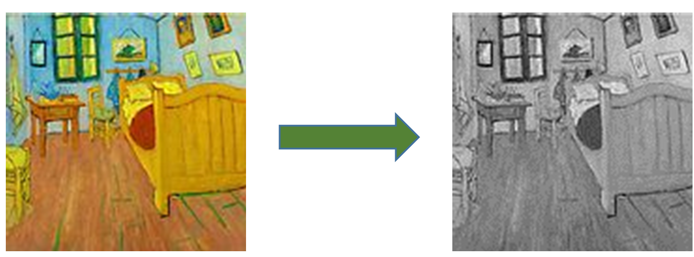

# DMA 实验

## 1. 概述
本实验将练习如何使用Nexys4 DDR开发板上的VGA接口，从而熟悉和掌握DMA技术。

## 2. RVfpga_SoC硬件修改
启动Vivado，打开实验8的工程，确认axis_vga_ip已经添加到IP Catalog（如下图所示），如果没有添加先通过“Settings”将其添加到IP Catalog。

点击“Open Block Design”打开块设计，点击“Add IP”添加axis_vga_ip，再添加一个AXI Direct Memory Access模块，添加后的块设计如下图所示。

双击axi_dma_0模块，按下图所示进行设置。

双击axi_interconnect_0模块，再增加一个从端口，如下图所示。

点击“Add IP”添加一个Clocking Wizard模块，为axis_vga_ip提供一个25MHz的时钟。

然后，如下图所示，将axi_dma_0、axis_vga_ip_0、axi_interconnect_0和clk_wiz_0等模块连接起来。

将axis_vga_ip_0模块的hsync、vsync、rgb和led引脚设置为外部引脚，并重新命名，如下图所示。

点击“Add IP”添加再添加一个AXI Interconnect模块，双击该模块，按下图所示进行设置。

如下图所示，将axi2wb_intcon_wrapper_0模块的o_ram_axi4引脚从输出引脚上断开，连接到新添加的axi_interconnect_1模块的一个主端口上；axi_dma_0模块的M_AXI_MM2S引脚连接到新添加的axi_interconnect_1模块的另一个主端口上；axi_interconnect_1模块的M00_AXI引脚连接到“ram”外部引脚上；然后相应的连接axi_interconnect_1模块的时钟和复位。

打开“Address Editor”，分配相应的地址，如下图所示。

点击Validate Design，对设计的正确性进行校验。校验过程中如果出现警告，点击OK忽略。

点击Generate Block Design，弹出对话框后选择Generate更新swerv_soc_wrapper文件。

根据更新后的swerv_soc_wrapper对rvfpga.sv文件进行修改，如下图所示，添加VGA的输出端口，同时增加swerv_soc_wrapper模块的端口引用。

再根据修改后的rvfpga.sv文件对rvfpga.xdc约束文件进行修改，如下图所示，增加对VGA引脚的约束。

最后，点击Generate Bitstream按键，生成bitstream文件。

