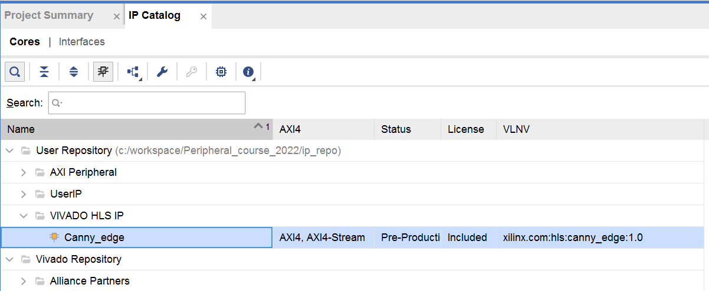
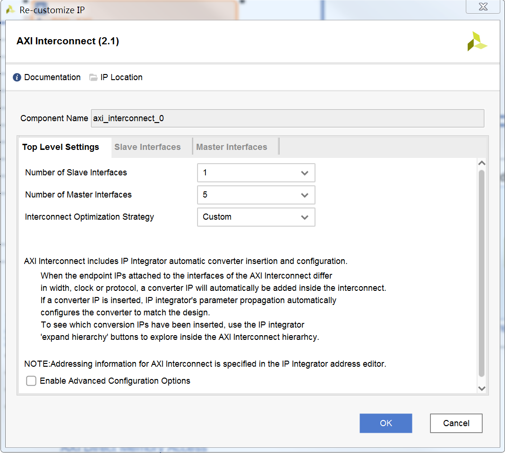
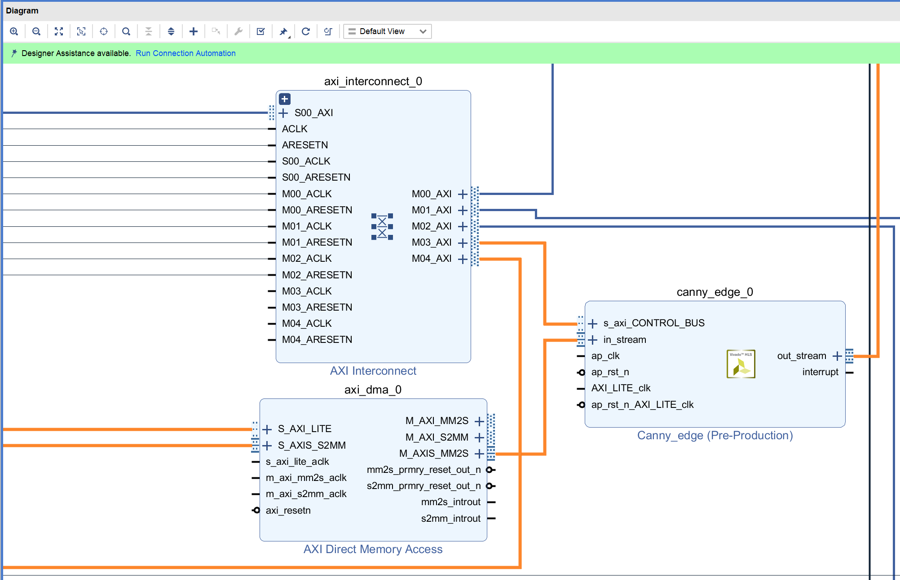

# DMA 实验

## 1. 概述
本实验将通过图像处理例子来演示DMA模块的使用，从而熟悉和掌握DMA技术。

## 2. RVfpga_SoC硬件修改
启动Vivado，打开实验8的工程，确认Canny_edge已经添加到IP Catalog（如下图所示），如果没有添加先通过“Settings”将其添加到IP Catalog。



点击“Open Block Design”打开块设计，点击“Add IP”添加Canny_edge，再添加一个AXI Direct Memory Access模块，添加后的块设计如下图所示。


双击axi_dma_0模块，按下图所示进行设置。


双击axi_interconnect_0模块，再增加二个从端口，如下图所示。



然后，如下图所示，将axi_dma_0、canny_edge_0和axi_interconnect_0模块连接起来。


点击“Add IP”添加再添加一个AXI Interconnect模块，双击该模块，按下图所示进行设置。


如下图所示，将axi2wb_intcon_wrapper_0模块的o_ram_axi4引脚从输出引脚上断开，连接到新添加的axi_interconnect_1模块的一个主端口上；axi_dma_0模块的M_AXI_MM2S和M_AXI_S2MM引脚连接到新添加的axi_interconnect_1模块的另二个主端口上；axi_interconnect_1模块的M00_AXI引脚连接到“ram”外部引脚上。


然后相应的连接新添加的各个模块的时钟和复位。


打开“Address Editor”，分配相应的地址，如下图所示。


点击Validate Design，对设计的正确性进行校验。校验过程中如果出现警告，点击OK忽略。

最后，点击Generate Bitstream按键，生成bitstream文件。

## 3. 软件图像处理
创建RVfpga工程，编写程序，通过软件对图像进行处理，如下图所示，将RGB图像处理生成灰度图像。


图像处理完成后，为了直观的获取图像处理结果，可以在程序执行结束之前将图像存储的内存区域的内容转储到文件中。为此，需要使用GDB调试器的dump命令，具体步骤如下：

- 在主函数的末尾安排无限循环（while(1);），程序完成上述灰度图像转换后，会到达末尾的无限循环，此时单击GDB调试器的“Pause”（暂停）按钮暂停执行；
- 通过在“Debug Console”（调试控制台）中运行以下命令（如下图所示）导出灰度图像（GreyImage）：

```
cd AdditionalFiles
dump value GreyImage.dat GreyImage
```


- 将.dat文件转换为可在系统中查看的.ppm文件

在LINUX中，通过打开终端并输入以下命令来执行此操作：

```
cd ./AdditionalFiles
gcc -o dump2ppm dump2ppm.c
./dump2ppm GreyImage.dat GreyImage.ppm 128 128 1
```

在WINDOWS中，通过以下任一方式来执行此操作：
直接使用AdditionalFiles中提供的dump2ppm.exe可执行文件打开命令shell，转到相应文件夹，并使用与上面相同的参数运行可执行文件：
`dump2ppm.exe GreyImage.dat GreyImage.ppm 128 128 1`
或者，使用Cygwin来编译dump2ppm.c程序；然后，在Cygwin终端中或命令shell中运行程序（dump2ppm.exe）。

- 使用GIMP（GNU图像处理程序）打开.ppm文件

如果尚未安装该程序，请访问以下网站下载安装程序：https://www.gimp.org/downloads/ 

## 4. 硬件图像处理
创建RVfpga工程，编写程序，通过硬件对图像进行处理，如下面二个图所示，对RGB图像处理采用Canny算法进行边缘检测。用硬件进行图像处理时，需要通过DMA将待处理的图像数据从内存传送到Canny_edge硬件模块上进行边缘检测，Canny_edge硬件模块处理好的图像数据则需要同时再次通过DMA传送回内存。


