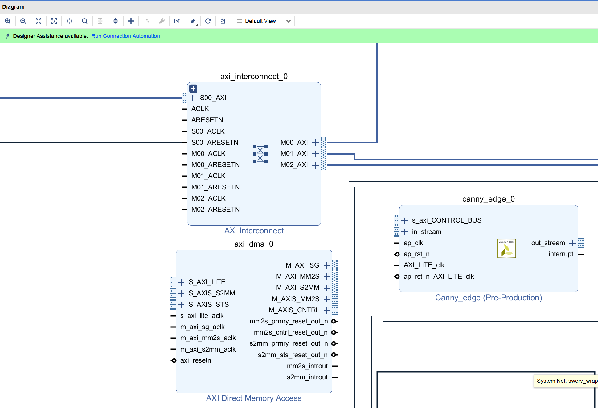
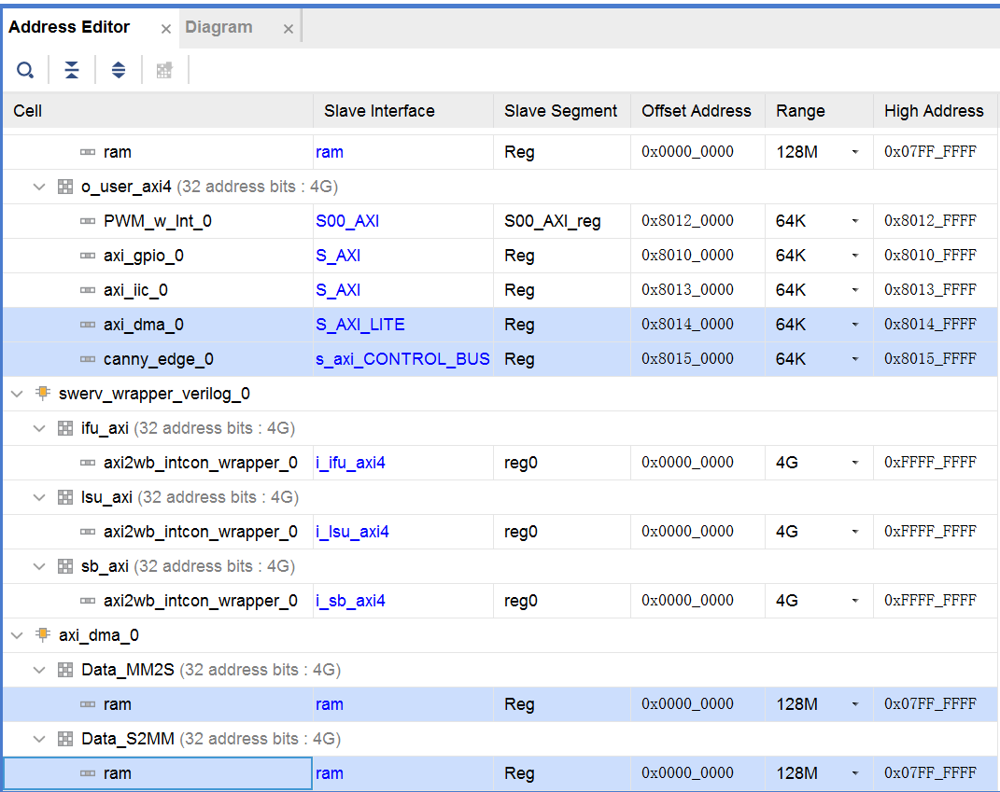

# DMA 实验

## 1. 概述
本实验将通过图像处理例子来演示DMA模块的使用，从而熟悉和掌握DMA技术。

## 2. RVfpga_SoC硬件修改
启动Vivado，打开实验8的工程，确认Canny_edge已经添加到IP Catalog（如下图所示），如果没有添加先通过“Settings”将其添加到IP Catalog。

点击“Open Block Design”打开块设计，点击“Add IP”添加Canny_edge，再添加一个AXI Direct Memory Access模块，添加后的块设计如下图所示。

双击axi_dma_0模块，按下图所示进行设置。

双击axi_interconnect_0模块，再增加二个从端口，如下图所示。

然后，如下图所示，将axi_dma_0、canny_edge_0和axi_interconnect_0模块连接起来。

点击“Add IP”添加再添加一个AXI Interconnect模块，双击该模块，按下图所示进行设置。

如下图所示，将axi2wb_intcon_wrapper_0模块的o_ram_axi4引脚从输出引脚上断开，连接到新添加的axi_interconnect_1模块的一个主端口上；axi_dma_0模块的M_AXI_MM2S和M_AXI_S2MM引脚连接到新添加的axi_interconnect_1模块的另二个主端口上；axi_interconnect_1模块的M00_AXI引脚连接到“ram”外部引脚上。

然后相应的连接新添加的各个模块的时钟和复位。

打开“Address Editor”，分配相应的地址，如下图所示。

点击Validate Design，对设计的正确性进行校验。校验过程中如果出现警告，点击OK忽略。

最后，点击Generate Bitstream按键，生成bitstream文件。

## 3. 应用程序
创建RVfpga工程，编写程序，通过DMA方式给VGA接口提供显示数据，在显示器上进行图片的显示。

## 4. 动手实践
上面给出的实验能够在VGA显示器上显示640X480分辨率的图像，修改axis_vga_ip自定制IP及相应的硬件和软件，完成更高分辨率的VGA显示。

